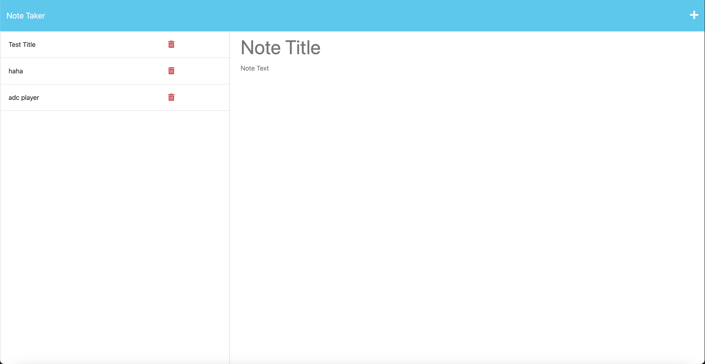

# Note-Taker

## Description

This is an application to write and save notes. Sometimes I can be forgetful and not keep things in my mind as well as I would like. With this note taker application, I don't need to worry about that at all, and can simply jot them all down as they come into my head. Some new skills that I learned was using express and NodeJS together to fetch data from a database and save it to further build more responsive web applications.

## Installation

The first step you must do is clone the repository.
Next, you have to open your command line (either bash or terminal) and run npm i to install all the dependencies.
To run the server, run the command "node server.js", and you can type in http://localhost:3001 to view the website.

## Usage

After going to localhost:3001 in your browser, you will be on the website that should look something like this:

To enter a note in, click on the plus icon on the top right corner and enter in whatever information you want for the note title and the note text. To save a note, click the save icon that should pop up after you input your note title and text. Once saved, your notes should be visible on the left hand side of the webpage.

## License

Please refer to the license in the repo.
